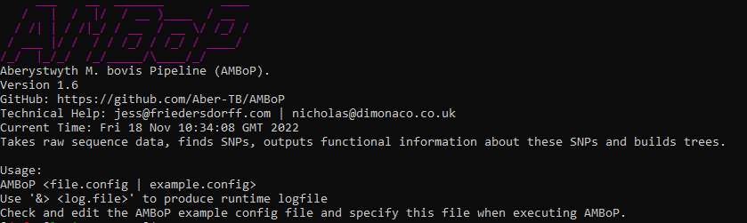

# The Centre of Excellence for Bovine Tuberculosis (CBTB) - Aberystwyth M.Bovis Pipeline (AMBoP)
## Contacts: Jess Friedersdorff  *jess@friedersdorff.com* - Nicholas Dimonaco *nicholas@dimonaco.co.uk*



### Software and versions used:
bcftools  1.16 | 
bwa  0.7.17 |
fastqc  0.11.9 |
iqtree  2.2.0.3 
+ultrafast bootstrapping
+model-finder |
multiqc  1.13 |
raxml  8.2.12 |
samtools  1.16.1 |
snp-sites  2.5.1 |
snpeff  5.1 |
trimmomatic  0.39 |


## Pipeline Overview: 
Aberystwyth M. bovis Pipeline (AMBoP) is a pipeline (HPC Module) that takes raw sequence data, runs all the tools needed to find SNPs and 
then outputs functional information about these SNPs and builds trees.

Firstly, a user must create the config file, and load the conda environment using:
```
conda env create --file AMBoP_Conda_env.yaml
```

Then AMBoP works briefly as follows:
1. Reads in the config file, makes directories, check it can find the input raw read files.
2. OPTIONAL: quality checking is carried out on raw reads. 
3. Trims reads using Trimmomatic according to user defined parameters in the config file. Removes unnecessary unpaired files.
4. OPTIONAL: quality checking is carried out on trimmed reads. 
5. Aligns trimmed reads to reference using BWA mem, default settings.
6. Fed straight into Samtools which removes any unmapped reads, non-primary or supplementary alignments and sorts bam file.
7. Duplicates are removed from bam file using Samtools and indexed. Old bam files are removed, only deduped and sorted are retained.
8. Mapping checks are carried out using calculate_genomecov.sh (found in aux_tools provided) creating bamfile_coverage.list.
9. Files are selected that pass using select_files.sh which keeps any files with over 90% of the genome covered by at least 1 read. These passed files are symbolically linked in a new directory.
10. Bcftools mpileup used to call SNPs, with -d 1000 (1000 reads called per position), then bcftools call with –ploidy, multiallelic caller and returning variants only (removing indels).
11. Each vcf file (one per sample) is then filtered using 4 cut offs set by the config file. The defaults in the config file are those used for Mycobacterium bovis analysis (https://github.com/ellisrichardj/BovTB-nf) and can be found in other publications. The settings as defaults are DP>=10 (At least 10 reads needed to cover a site) & MQ>=30 (mapping quality at least 30) & DP4[2]>=1 & DP4[3]>=1 (at least 1 forward read and 1 reverse read covering the site) & (DP4[2]+DP4[3])/(DP4[0]+DP4[1]+DP4[2]+DP4[3])>=95 (allele supported by 95% of the reads covering the site).  
12. Run the vcfs through variantpositionfiltering.py and exclude_regions.py which will filter out SNPs within a user defined number of base pairs of other SNPs and ignores SNPs in regions defined by the user provided in a file (provided in references). For M.bovis, these are known as regions of variance of higher mutation (PE/PPE etc). 
13. Filtered vcf files (one for each sample) are then compressed with bgzip, indexed with bcftools, then all files merged using bcftools. Files are merged in 2 steps (because bcftools cannot handle >1021 files in one go) – subsets of 500 files are merged first, then those subsets are merged. These extra files are not deleted because they are relatively small in size even for a data set of ~2000 samples.
14. Filtered and merged vcf file (containing all samples) is then compressed and indexed.
15. OPTIONAL - If a user has requested trees to be built, Bcftools query and consensus is used to create a fasta file of the whole genome for each sample (including their SNP sites). All fasta files are then catenated together into one “alignment” file. 
15 a. Snp-sites is used to find SNPs across all samples and make a pseudo-genome sequence for each sample. It is also used to calculate how many constant sites there are.
15 b. RAxML used to build tree using maximum likelihood, with fast bootstraps (100), seeds set to 12345, and GTRCAT model.
15 c. IQTree used to build tree using model prediction and fast bootstraps (1000).
16. OPTIONAL – if user requested functional information,  SnpEff is used to predict effect of SNPs and then also run functional_variants.py to find those SNPs within functional genes.
17. Some read statistics are calculated from raw reads, trimmed reads, aligned bam files and from the vcf files and put together into a csv file using read_stats.sh (provided in aux-tools)
18. Finally there is a clear up phase. A final_files directory is made here, and any of the functional outputs (SnpEff and functional_variants.py outputs), any input and output tree files from both RAxML and IQTree, the merged vcf file and the bam file coverage list file are all copied into this directory.
19. Then directories may be deleted, depending on what is specified in the config file by the user. Options are “TRIMMEDREADS” to remove trimmed reads, “BAMS” to remove bam files, “PASSEDFILES” to remove the directory with the symbolically links bam files that passed the genome coverage filter, “FASTA” which removes all the FASTA files, and “VARIANTS” which removes the variants directory containing all the individual vcfs, or “ALL” which will remove all of the listed.

## Pipeline User Definable Parameters:

1.	MYPATH – Path to output directory.
2.	DATAPATH - Path to raw data (as fastq.gz files, paired reads only)
3.	REFPATH - Path to the reference mbovis genome fasta file (mbovisAF212297 – provided).
4.	AUX_TOOLS - Set path to where the aux_tools directory is.
5.	ADAPTERS - Path to the Illumina adapters for Trimmomatic read trimming (provided).
6.	REF_FUNC_ANNO - Path to the csv file used to transfer EggNOG functions to SNP calls.
7.	UNIQ - 'Experiment' appendix to be used in file output.
8.	FORWARDPATTERN - Sets the sample raw read file pattern for forward reads.
9.	REVERSEPATTERN - Sets the sample raw read file patterns for reverse reads.
10.	FASTQC – set to true or false – whether or not to perform FastQC quality checking on raw reads.
11.	TRIM_FASTQC - set to true or false – whether or not to perform FastQC quality checking on trimmed reads.
12.	TREE - Set to true or false - do you want to receive trees?
13.	FUNCTIONAL - Set to true or false - do you want to receive functional information about the SNPs?
14.	ILLUMINACLIP - Set which adapter and other illumina-specific sequences to be cut from the read.
15.	SLIDINGWINDOW - Set sliding window size to analyse average quality of read.
16.	MINLEN - Set minimum allowed length of read.
17.	AVGQUAL - Set the average quality score used to remove read.
18.	THREADS - Number of CPU threads to be used for each tool stage.
19.	BWA_THREADS - Number of CPU threads to be used specifically for bwa.
20.	MQ - SNP mapping quality.
21.	DP - SNP read depth.
22.	DP4F - Number of supporting forward reads.
23.	DP4R - Number of supporting reverse reads.
24.	SUPPORT - Percentage of reads needed to support an alternative site.
25.	VAR_POS_NUM - The number of base pairs that a variant can be away from another variant reported.
26.	REGIONS - Path to a file that contains a list of regions, with one region per line, and start and end positions separated by a comma - 12345,67890. (If no regions to be excluded, set file to 0,0).
27.	SNPEFF_DB – the name of the SnpEff database (this can be one of the default SnpEff databases they provide or one readily made, check the SnpEff manual for this)
28.	CLEANUP - Sets which files to clean up after completed runtime (options are NONE, TRIMMEDREADS, BAMS, PASSEDFILES, FASTA, VARIANTS).


